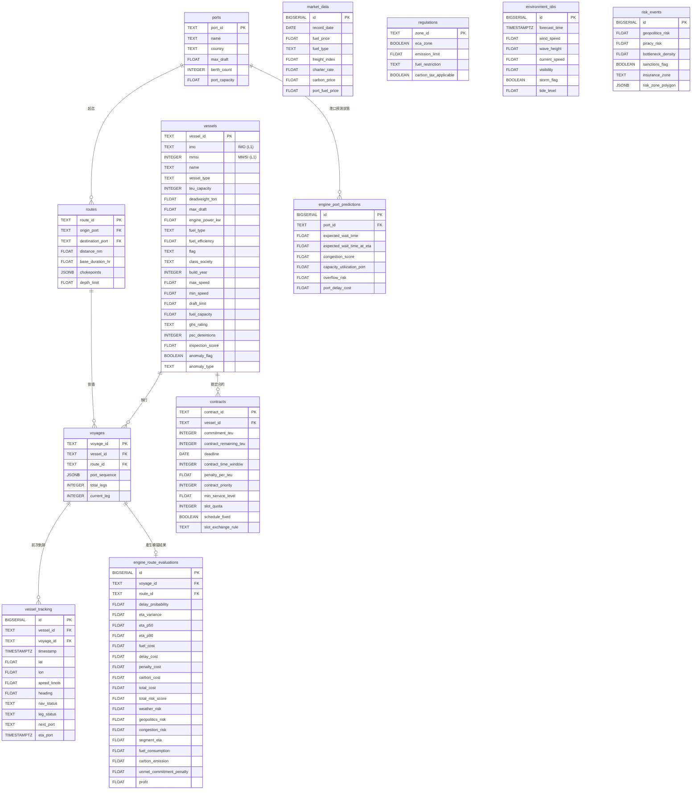

# 基於 API 確認表的純粹資料庫架構設計 (API-Driven Database Schema)

這份架構圖**完全遵循您的 `API確認表.xlsx`** 內的欄位與模組分類，將 API 定義的 SubCategories 轉化為關聯式資料庫 (RDBMS) 的實體資料表。

我們將原本散落的 API 回傳欄位，精煉為四大核心領域（Domain）：
1. **核心主檔層 (Core Entities)**：船舶、港口、航線、航次。
2. **商業營運層 (Commercial)**：合約、聯盟、市場票價與法規。
3. **動態觀測層 (Dynamic Context)**：AIS 軌跡、氣象海象、地緣風險。
4. **引擎預測層 (Engine Outputs)**：由模擬引擎產生的延遲、成本、風險與評估結果。

---

## API 領域驅動 ER Diagram (Mermaid)

## 設計思維解析 (Architecture Rationale)

1. **實體整併**：在 API 中，`vessel`、`Physical` (物理限制) 與 `VesselRisk` (安檢紀錄) 被拆分為不同的 API 分類，但在資料庫底層，這些都是同一艘船的屬性，因此我們將其完美整併至單一的 `vessels` 實體表。
2. **商業邏輯支援**：API 中定義了 `Contract` 與 `Alliance`，這意味著這個系統不僅僅是「避險」，還牽涉到「運力調度」與「違約罰金 (`penalty_cost`)」。因此獨立出 `contracts` 表格，讓航次模擬時可以精算利潤 (`profit`)。
3. **強大的模擬引擎層 (Engine Outputs)**：API 確認表中擁有高達 6 種不同的 Engine (Cost, Delay, Risk, Port, Route, Voyage)，這些輸出非常適合存入 `engine_route_evaluations` 與 `engine_port_predictions` 表中，作為前端 Dashboard 展示歷史預測與未來趨勢的資料源。
